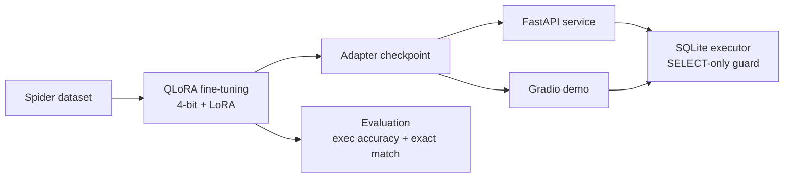

# text-to-sql

Turns "how many singers are there" into `SELECT COUNT(*) FROM singer`, fine-tuned with QLoRA.


## Why this exists

Built to actually understand QLoRA end to end, not just run someone else's notebook: quantization, LoRA adapter placement, the data formatting details that only surface once you fine-tune a real model against a real benchmark. Wanted the full loop, from raw dataset to a served API to a public demo, with real evaluation numbers at the end instead of a loss curve screenshot. Spider was the obvious target: cross-domain, schema-aware, and hard enough that a small fine-tuned model beating the base model actually means something.

<!--  -->
*(Demo GIF and a live Space link go here once the model is trained and deployed. For now, see [Quick start](#quick-start).)*

## Features

- QLoRA fine-tuning on Spider: 4-bit NF4 quantization plus LoRA adapters, default target is Qwen2.5-Coder-3B-Instruct, trains on a single T4.
- Schema-aware prompts: the model sees the actual table and column names for whichever database it's querying, so it generalizes past the databases it trained on.
- FastAPI service (`/generate`, `/query`, `/schema/{db_id}`) with a SELECT-only execution guard: generated SQL runs against real SQLite databases, but INSERT, UPDATE, DROP, ALTER, and friends get rejected before they touch anything.
- Evaluation against Spider's own metrics, execution accuracy and exact match, with a base-vs-fine-tuned comparison table.
- Gradio demo built for Hugging Face Spaces (ZeroGPU): pick a database, ask a question, see the generated SQL and the actual result set.
- 63 tests covering the SQL guard, schema extraction, prompt building, and the API, running in under a second in CI, no GPU required.

## Quick start

```bash
pip install -r requirements.txt
bash scripts/download_spider.sh          # pulls the Spider dataset
bash scripts/run_training.sh             # QLoRA fine-tune, a few hours on a T4
uvicorn api.main:app --reload            # serve the API on localhost:8000
```

Or run the API in Docker: `docker build -t text-to-sql-api . && docker run --gpus all -p 8000:8000 text-to-sql-api`.

## How it works

Spider examples get converted into chat-formatted (schema, question, SQL) triples. The base model loads in 4-bit and gets wrapped with LoRA adapters, then fine-tunes so the loss only counts the SQL turn, not the schema or question. Training and inference use the exact same prompt format on purpose: a mismatch there quietly kills generation quality in a way that's easy to miss.



## Tech stack

Python, PyTorch, Transformers, PEFT, TRL, bitsandbytes, FastAPI, Gradio, SQLite.

## Status

Training pipeline, API, and test suite are done and passing CI. Next up: the actual Kaggle training run, publishing the adapter to Hugging Face Hub, and deploying the public Space.
<!-- `[add benchmark here]` once that run finishes. -->

## Contributing

Issues and PRs welcome. This is a personal project, so response time varies.

## License

Code is MIT, see [LICENSE](LICENSE). The default base model, Qwen2.5-Coder-3B-Instruct, runs under the Qwen Research License (non-commercial only, unlike most of the rest of that model family, which is Apache 2.0). Spider itself is released by Yale under a non-commercial research license. Full details, required attribution, and what changes if you want to use this commercially: [NOTICE.md](NOTICE.md).